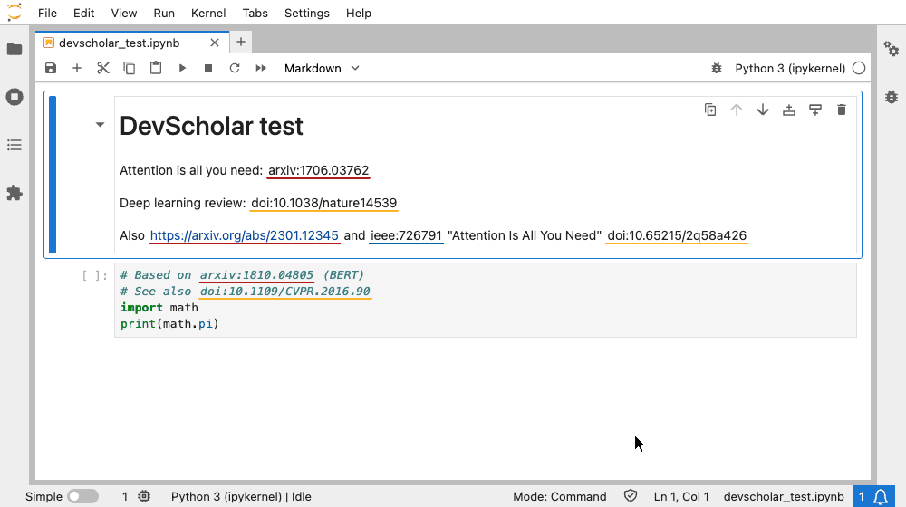
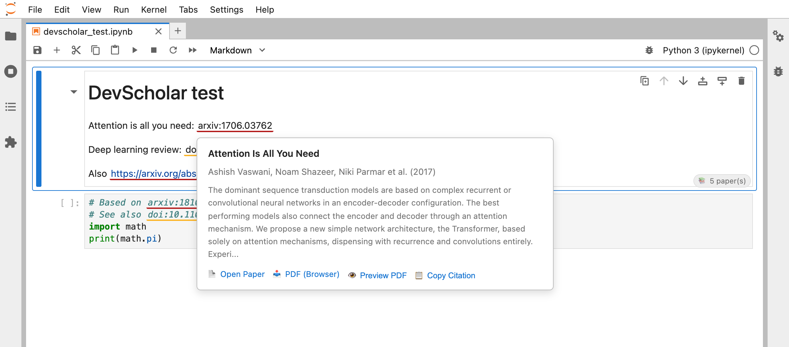
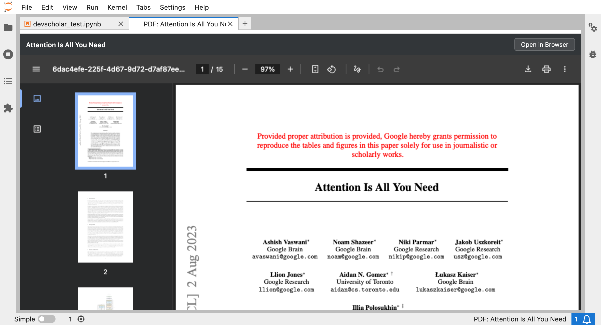
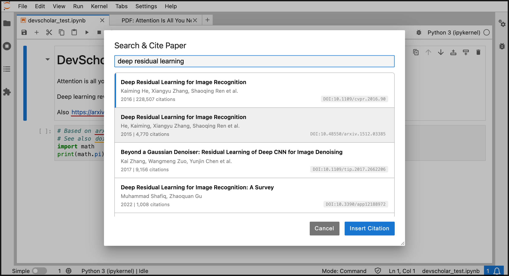

# DevScholar for JupyterLab

[](https://pypi.org/project/devscholar-jupyter/)
[](LICENSE)
[](https://github.com/pallaprolus/devscholar-jupyter/actions/workflows/test.yml)

**Your Notebooks, Connected to Knowledge.**

DevScholar automatically detects research paper references (arXiv, DOI, IEEE, Semantic Scholar) in your Jupyter notebooks and provides rich metadata on hover, PDF preview, and citation management.



<details>
<summary>Screenshots: hover metadata, PDF preview and Search &amp; Cite</summary>







</details>

If DevScholar saves you time, please ⭐ [star the repository](https://github.com/pallaprolus/devscholar-jupyter). It helps other researchers find it.

## Features

### 1. Automatic Paper Detection
Detects paper references in both code comments and markdown cells:
- **arXiv**: `arxiv:1706.03762`, `https://arxiv.org/abs/2301.12345`
- **DOI**: `doi:10.1038/nature14539`, `https://doi.org/...`
- **IEEE**: `ieee:726791`, IEEE Xplore URLs
- **Semantic Scholar**: Paper URLs and Corpus IDs
- **OpenAlex**: `openalex:W1234567890`

### 2. Rich Hover Metadata
Hover over any paper reference to see:
- Title & Authors
- Abstract
- Publication Year
- Citation Count (DOI, OpenAlex and Semantic Scholar references)
- Direct links to PDF and paper page

Metadata comes from APIs that allow browser requests: DataCite for arXiv,
OpenAlex for DOIs, and Semantic Scholar for Semantic Scholar IDs. IEEE
document numbers are linked to IEEE Xplore without metadata, because no open
API resolves them.

**Citation counts for arXiv papers** need a free
[Semantic Scholar API key](https://www.semanticscholar.org/product/api).
Paste it into *Settings → Settings Editor → DevScholar → Semantic Scholar API
Key*. Without a key Semantic Scholar rate-limits anonymous browser requests
too aggressively to be usable, so arXiv references show title, authors, year
and abstract only.

### 3. Smart Highlighting
Paper references are underlined with color-coded indicators by source type,
both in rendered markdown and inside the cell editor.

### 4. Search & Cite
Search for papers by name and insert citations directly into your notebook:
- Use `Ctrl/Cmd+Shift+P` or Command Palette → "Search & Cite Paper"
- Search by title, author, or keyword
- Results from OpenAlex with citation counts
- Inserts properly formatted citations

### 5. PDF Preview
Preview paper PDFs directly inside JupyterLab:
- Click "Preview PDF" in the hover tooltip, or run "Preview Paper PDF"
- Uses the browser's built-in PDF viewer (paging, zoom, search, text selection)
- Works with arXiv and open access papers whose host allows browser downloads

### 6. Citation Management
- **Show All Paper References**: A dialog listing every reference in the notebook with links
- **Export Bibliography**: Copies BibTeX for all papers to the clipboard (shown in a dialog if the clipboard is unavailable)

### 7. Zotero Sync
Two-way sync between your notebooks and Zotero library:
- Export papers from notebooks to Zotero
- Import citations from Zotero
- Link workspaces to Zotero collections
- Duplicate detection

### 8. Mendeley Sync
Two-way sync with Mendeley:
- Export papers to Mendeley
- Import citations from Mendeley
- Link workspaces to Mendeley folders

Mendeley has no browser login flow, so you paste an OAuth access token via
*Set Mendeley Access Token*. Tokens expire after about an hour; run the
command again when sync starts reporting authorization errors.

## Installation

### Prerequisites
- JupyterLab >= 4.0

### Install from PyPI
```bash
pip install devscholar-jupyter
```

### Install from source (development)
```bash
git clone https://github.com/pallaprolus/devscholar-jupyter.git
cd devscholar-jupyter
pip install -e .
jupyter labextension develop . --overwrite
```

## Usage

1. Open any Jupyter notebook
2. Add paper references in comments or markdown:

**In code cells:**
```python
# Implements attention mechanism from arxiv:1706.03762
def attention(q, k, v):
    ...
```

**In markdown cells:**
```markdown
This implementation is based on the Transformer architecture
described in [arxiv:1706.03762](https://arxiv.org/abs/1706.03762).
```

3. Hover over references to see metadata
4. Use Command Palette → "DevScholar: Export Bibliography" to get BibTeX

## Commands

All commands are in the Command Palette under the *DevScholar* categories.

| Command | Description |
|---------|-------------|
| Show All Paper References | Dialog listing every reference in the notebook with links |
| Search & Cite Paper | Search OpenAlex and insert a citation into the active cell (`Ctrl/Cmd+Shift+P`) |
| Export Bibliography (BibTeX) | Copy BibTeX for all papers to the clipboard |
| Preview Paper PDF | Open the PDF of the first paper that has one in a JupyterLab tab |
| Set Zotero API Key · Sync Papers to Zotero · Link Zotero Collection · Import Papers from Zotero | Zotero sync |
| Set Mendeley Access Token · Sync Papers to Mendeley · Link Mendeley Folder · Import Papers from Mendeley | Mendeley sync |
| DevScholar on GitHub · Report a DevScholar Issue | Project links, also in the Help menu |

## Settings

Configure via Settings → Settings Editor → DevScholar:

| Setting | Default | Description |
|---------|---------|-------------|
| `highlightPapers` | `true` | Underline paper references in rendered markdown |
| `showTooltips` | `true` | Show metadata on hover |
| `parseCodeCells` | `true` | Detect papers in code-cell comments |
| `parseMarkdownCells` | `true` | Detect papers in markdown cells |
| `showPaperCount` | `true` | Show the paper-count badge on cells with references |
| `semanticScholarApiKey` | empty | Optional key that adds citation counts for arXiv papers |

## Related Projects

- [DevScholar for VS Code](https://github.com/pallaprolus/dev-scholar) - The original VS Code extension

## Feedback

Bugs and ideas: https://github.com/pallaprolus/devscholar-jupyter/issues (also reachable from *Help → Report a DevScholar Issue* inside JupyterLab).

## License

MIT License - see [LICENSE](LICENSE) for details.

---

**Part of the DevScholar ecosystem** - Connecting code to knowledge.
